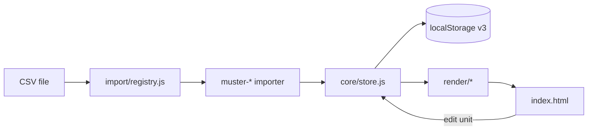

# Architecture

The Muster Roll is a **static site** — no build step required. ES modules load directly in the browser for easy publishing (GitHub Pages, Netlify, any static host).

## Layout

```
index.html              Entry shell (HTML only)
css/
  tokens.css            Theme variables (dark / light)
  app.css               Components and layout
js/
  app.js                Bootstrap, event wiring
  core/
    constants.js        Defaults: pipeline, paint types; re-exports factions
    pipeline.js         State normalization, progress math, custom pipeline hook
    store.js            Versioned localStorage, migrations, JSON backup
  data/
    factions/           defs-*.js, contrast audit, resolve/merge (see docs/FACTION_PRESETS.md)
    faction-presets.js  Re-export shim for older import paths
    csv.js              Parse / serialize / validators
    schema.js           Column definitions, format detection helpers
  import/
    registry.js         Pluggable importer list + routing
    muster-armies.js    Native armies CSV importer
    muster-paints.js    Native paints CSV importer
    index.js            Import/export orchestration
  render/
    armies.js           Armies tab UI
    paints.js           Paints tab UI
    index.js            renderAll()
  ui/
    theme.js            Dark / light mode
    modal.js            Import result dialog
    toast.js            Save feedback
    dropzone.js         Drag-and-drop CSV
docs/
  SCHEMA.md             CSV column reference
  FACTION_PRESETS.md    Faction crest/colour architecture
  IMPORTING_CSV.md      User import guide
samples/                (optional) example CSVs at repo root
```

## Data flow



## Store schema (v3)

```json
{
  "version": 3,
  "collection": [],
  "paints": [],
  "settings": {
    "theme": "dark",
    "pipeline": null,
    "factionPresets": null
  }
}
```

- `pipeline: null` → use `DEFAULT_PIPELINE` from `constants.js`
- `factionPresets: null` → use built-in catalogue; non-null values are **merged as overrides** (see [FACTION_PRESETS.md](FACTION_PRESETS.md))
- Army objects may include optional `crestOverride` / `colorOverride`; UI resolves live colours via `getArmyPresentation()`
- Legacy `musterRoll.v2` (`{ c, p }`) migrates automatically on first load

## Extension points (mapped to future ideas)

| Idea | Where to extend |
|------|-----------------|
| **1. CSV tool for new users** | `data/schema.js` templates; `import/index.js` export; empty states in `render/*` |
| **2. Dark mode** | `css/tokens.css`, `ui/theme.js`, `settings.theme` |
| **3. Publishing** | Deploy repo root; entry is `index.html` |
| **4. Data save** | `store.js` — add cloud adapter beside `save()` / `load()`; `exportSnapshot()` for JSON backup |
| **5. Migration from other tools** | Add importer to `import/registry.js` with `detect()` + `import()` |
| **6. Custom states** | `settings.pipeline` array; `pipeline.setCustomPipeline()`; future settings UI |

### Adding a third-party importer

```js
// js/import/example-tool.js
export const exampleImporter = {
  id: 'example-tool',
  label: 'Example Tool Export',
  domain: 'armies',           // 'armies' | 'paints'
  detect: (rows) => { /* inspect headers */ },
  import: (rows, ctx) => { /* return ImportResult */ },
};
```

Register in `import/registry.js`:

```js
import { exampleImporter } from './example-tool.js';
export const IMPORTERS = [musterArmiesImporter, musterPaintsImporter, exampleImporter];
```

### Custom pipeline states

```js
import { setCustomPipeline, store } from './core/pipeline.js';
setCustomPipeline(store, [
  { key: 'NIB', hex: '#444' },
  { key: 'Built', hex: '#6366f1' },
  { key: 'Painted', hex: '#22c55e' },
]);
```

Persist via `patchSettings({ pipeline: store.settings.pipeline })`.

## Publishing

Any static host works. Requirements:

1. Serve `index.html` at site root
2. Serve `css/` and `js/` with correct MIME types
3. ES modules need **HTTPS or localhost** (GitHub Pages provides HTTPS)

See [README.md](../README.md) for GitHub Pages steps.
